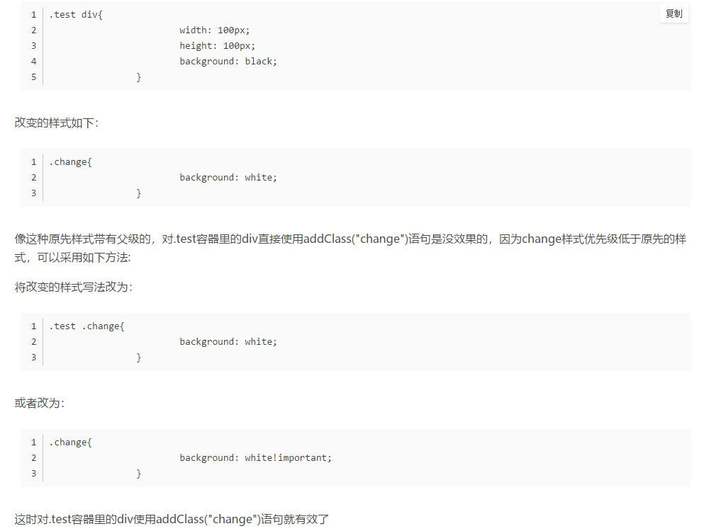
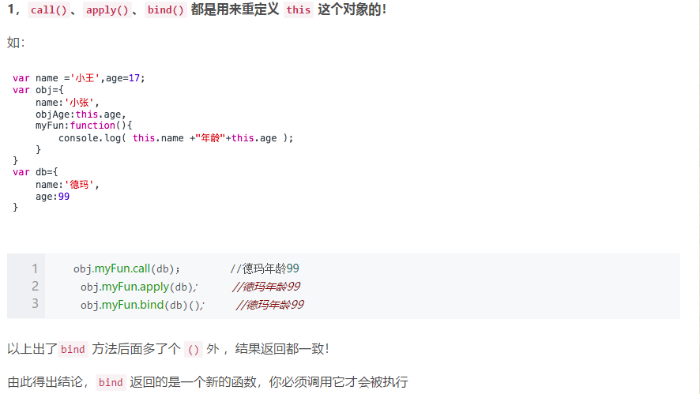

### demo_1

#### jQuery中的addClass()方法不起作用？

[参考资料](https://blog.csdn.net/wz13759497175/article/details/79302417)

 	使用jquery的addClass方法后，样式已经成功添加，但还是没有效果，是因为**新添加的样式的优先级比起原先的样式低**所致。 

### demo_2

#### call（）与apply（）的作用与区别

 **作用**	`call（）`方法和`apply（）`方法的作用相同： **重定义** **改变this指向**

**区别**	他们的**区别**在于接收参数的方式不同：

`call（）`：第一个参数是this值没有变化，变化的是**其余参数都直接传递给函数**。在使用`call（）`方法时，**传递给函数的参数必须逐个列举出来**

`apply（）`：传递给函数的是**参数数组**

~~~js
function add(c, d){ 
    return this.a + this.b + c + d; 
} 
var o = {a:1, b:3}; 
add.call(o, 5, 7); // 1 + 3 + 5 + 7 = 16 
add.apply(o, [10, 20]); // 1 + 3 + 10 + 20 = 34 
~~~

从上面四个结果不难看出

- `call 、bind 、 apply` 这三个函数的第一个参数都是 `this` 的指向对象，第二个参数差别就来了：
- `call`的参数是直接放进去的，第二第三第`n`个参数全都用逗号分隔，直接放到后面 `obj.myFun.call(db,'成都', ... ,'string' )；`
- `apply`的所有参数都必须放在一个数组里面传进去 `obj.myFun.apply(db,['成都', ..., 'string' ]);`
- `bind`除了返回是函数以外，它 的参数和`call` 一样。

当然，三者的参数不限定是`string`类型，允许是各种类型，包括函数 、 `object` 等等